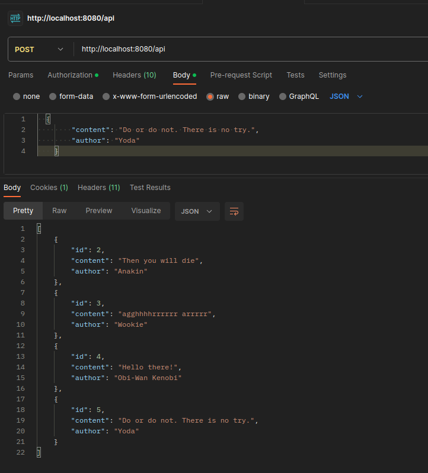
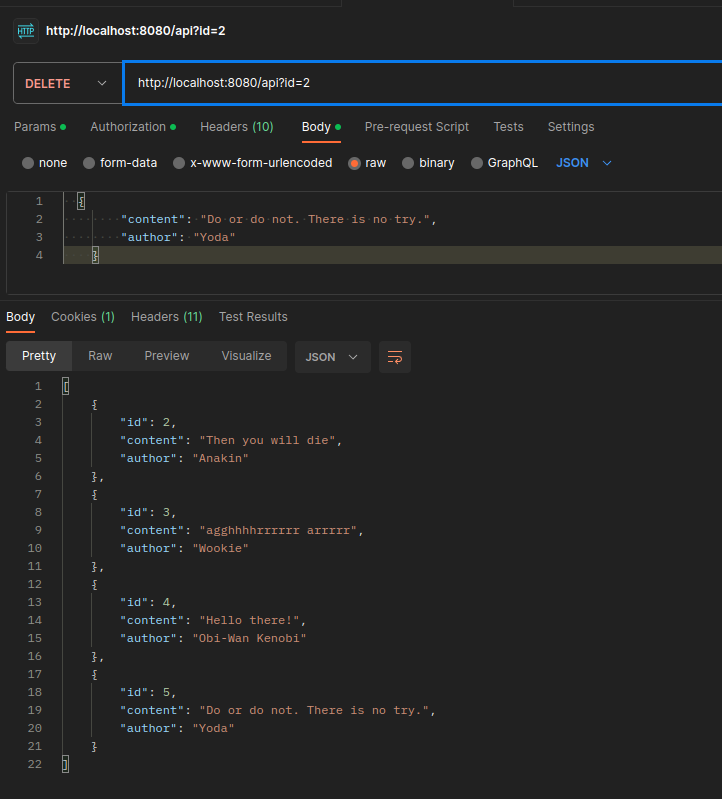
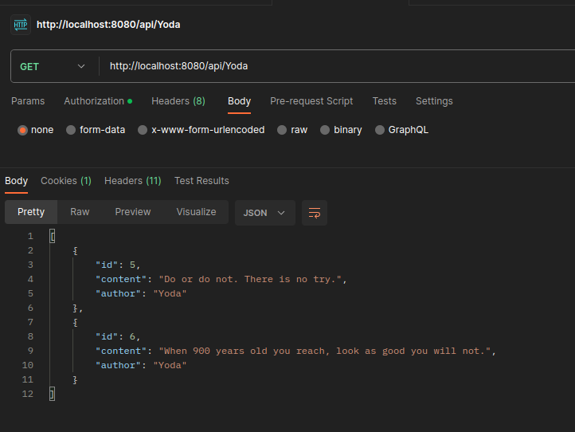

# API Star Wars - Quotations

# Description

This is a simple API that allows you to access quotes from the Star Wars universe. You can use this API to get a random quote or search for quotes by character.
Usage of spring security allows adding quotations only to users with the MODERATOR ROLE, also adding and editing only to users with the ADMIN ROLE.

### Add quote

To add a quote, simply execute a POST query at the following address:

localhost:8080/api

### Delete quote

To delete a quote, simply execute a DELETE query at the following address:

localhost:8080/api?id={id_number}

### All quotes

To get all quotes, simply execute a GET query at the following address:

localhost:8080/api

# Random quote

To get a random quote, simply execute a GET query at the following address:

localhost:8080/api/random

The response will contain a random Star Wars quote in JSON format.

# Quote by character

To get a quote about a specific character, perform a GET query at:

localhost:8080/api/{character_name}

Where {character_name} is the name of the character, e.g. Luke Skywalker.

# Contact

Contact If you have questions or comments regarding this API, please contact me at shad350@gmail.com.

# May the Force be with you! 🌌🚀🌟

